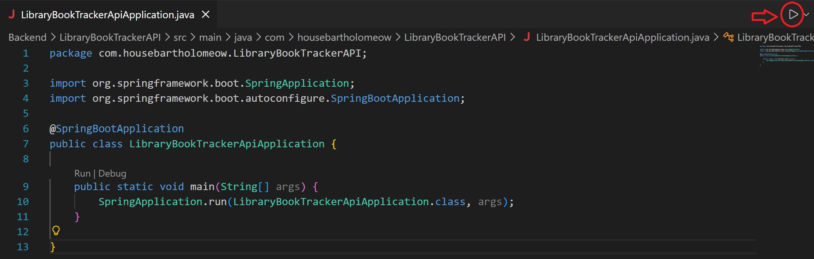

# DBProject_Group4_LibraryBorrowingTracker
members : 
- **Klara Ahinta Daniswara (24/532751/PA/22531)**
- **Daffa Aryza Pasya (24/532884/PA/22549)**
- **Shadiq Arif Aryasatya (24/536702/PA/22763)**

A backend and database-driven system used for managing library operations.  
This project provides core functionalities including:

- **CRUD operations**: Create, Read, Update, and Delete books, users, and reservations.
- **Search functionality**: Quickly find books or users based on multiple criteria.
- **Reporting features**: Generate basic reports for library usage and bookings.

This repository contains the full design, implementation, and documentation of the system.

## Installation and Setup

### All command line commands will be in Git Bash.

Clone the Github Repository
```bash
$ git clone https://github.com/DaffaReat/DBProject_Group4_LibraryBorrowingTracker
```
### Backend
In appliation.properties, make sure [MYSQL USERNAME] and [MYSQL PASSWORD] are set to the responding MYSQL
username and password.
```
spring.datasource.username=[MYSQL USERNAME]
spring.datasource.password=[MYSQL PASSWORD]
```
Run Spring Application in the IDE.


Backend will run on 'http://localhost:8080'.

### Frontend
Navigate to the frontend folder of the project
```bash
cd week4_integration/frontend
```
Install dependencies
```bash
npm install
```
Run the React Application
```bash
npm start
```

Frontend will run on 'http://localhost:3000'.
